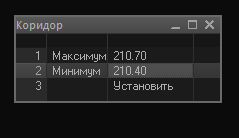

# Оповещения для QUIK
Несколько скриптов для оповещения по достижению цены, объема или по совершению сделки. В качестве сигнала используется запуск через консоль аудиозаписи в проигрывателе, у меня он настроен на циклическое воспроизведение. Можно поставить вместо проигрывателя любую другую команду, например отсылку сообщения в консольном мессенджере. Для указания цены и объемы сделан простенький интерфейс из встроенных таблиц, вроде такого:

В интерфейсе нужно мышкой кликнуть на заполняемое поле, и дальше оно заполняется с клавиатуры.

Описание скриптов:  
**test.lua** - просто запускает проигрыватель, для настройки звука.  
**SBER_corridor.lua** - срабатывает при выходе цены за указанные при запуске пределы.  
**SBER_volume.lua** - срабатывает если объем больше указанного, можно настроить объем по умолчанию.  
**order.lua** - срабатывает при первой же сделке по любой бумаге.

